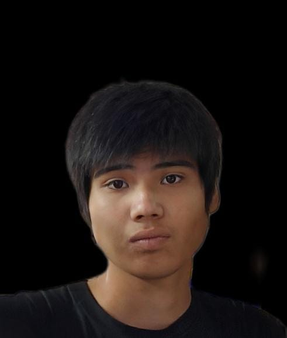
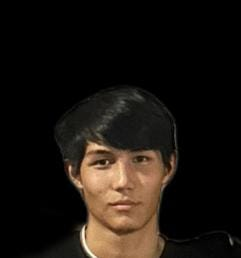

<!DOCTYPE html>
<html lang="ru">
<head>
<meta charset="UTF-8">
<meta name="viewport" content="width=device-width, initial-scale=1.0">
<title>UFC 344</title>

<link href="https://fonts.googleapis.com/css2?family=Inter:wght@400;600;700&display=swap" rel="stylesheet">

</head>

<body>

<header>
  <h1>UFC 344</h1>
</header>

  
Главный кард — 6 января

  
Место проведения: Рим, Италия

<!-- 1 -->

  

    

      

      Танат
    

    VS
    

      

      Али
    

  

  

    
Лёгкий вес • Главный бой

    
Судейское решение • Р5 05:00

  

<!-- 2 -->

  

    

      

      Бексултан
    

    VS
    

      

      Ибрахим
    

  

  

    
Полусредний вес • Со-главный бой

    
Добровольная сдача • Р1 04:45

  

<!-- 3 -->

  

    

      

      Жахан
    

    VS
    

      

      Абылайхан
    

  

  

    
Лёгкий вес

    
Судейское решение • Р3 05:00

  

<!-- 4 -->

  

    

      

      Бексултан
    

    VS
    

      

      Ерасыл
    

  

  

    
Полусредний вес

    
Отменен

  

  

    

      

      Жахан
    

    VS
    

      

      Ибрахим
    

  

  

    
Полусредний вес

    
Отменен

  

<footer>
  © 2025 My Fight Promotion. Все права защищены.
</footer>

</body>
</html>
