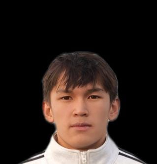

<html lang="ru">
<head>
  <meta charset="UTF-8">
  <meta name="viewport" content="width=device-width, initial-scale=1.0">
  <title>UFC 344</title>

  <link href="https://fonts.googleapis.com/css2?family=Inter:wght@400;600;700&display=swap" rel="stylesheet">

  
</head>
<body>

<header>
  

    
UFC 344

    <a class="header-btn" href="https://AlishkaNepo.github.io/ufc-343/" target="_blank">UFC 343</a>
  

</header>

  <h1>Главный кард — 6 Января</h1>
  
Рим, Италия

  

    

    
Танат

  

  
VS

  

    

    
Али

  

  

    
Лёгкий вес • Главный бой

    
Судейское решение • Р5 05:00

  

  

    

    
Бексултан

  

  
VS

  

    

    
Ибрахим

  

  

    
Полусредний вес • Со-главный бой

    
Добровольная сдача • Р1 04:45

  

  

    

    
Бексултан

  

  
VS

  

    

    
Ерасыл

  

  

    
Полусредний вес

    
Отменён

  

<footer>
  © 2025 My Fight Promotion. Все права защищены.
</footer>

</body>
</html>
